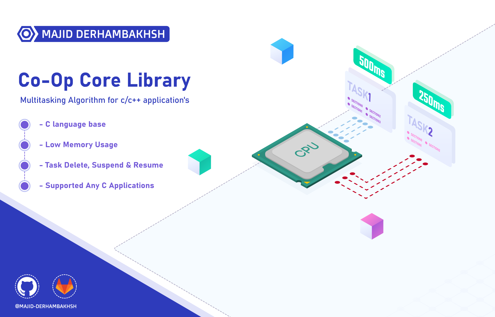

# Co-Op Core Library
Co-Op (Co-Operative) Multitasking Algorithm library for c/c++ application's

### Version : 1.0.0

- #### Type : Software/Embedded Software

- #### Support :  
     ```diff  
     + Any c/c++ software's   
     ```

- #### Program Language : C/C++

- #### Properties :

- #### Changes :  

- #### Required Library/Driver :


### Initialization and de-initialization functions:

### CoOp Core operation functions:
```c++
uint8_t Task_RegisterNew(cTask_TypeDef *uTask, cTaskFunc_TypeDef uFunc);
uint8_t Task_GetStepParam(uint8_t *paramIn);
void Task_SetNextStepParam(uint8_t nexStep);
void Task_IncTick(void);
void Task_Delay(uint16_t tim, uint8_t step);
void Task_Resume(cTask_TypeDef *uTask);
void Task_ResumeAll(void);
void Task_Suspend(cTask_TypeDef *uTask);
void Task_SuspendAll(void);
void Task_Delete(cTask_TypeDef *uTask);
void Task_DeleteAll(void);
void Task_RunCoOpSystem(void);
``` 

### Macros:
```c++
#define _COOP_NMB_OF_TASK
``` 

## How to use this library

### The CoOp Core library can be used as follows:
1.  Add coop_core.h header  

2.  Set the max number of tasks in coop_core_conf.h header, for example:  
        
```c++
/* -------- Configuration -------- */
#define _COOP_NMB_OF_TASK 3
```  
      
3.  Add Task_IncTick() in the 1ms timer ISR:  
        
```c++
Timer_ISR()
{
	Task_IncTick();
}
```  
      
4.  Create the Tasks and her functions:  
        
```c++
cTask_TypeDef Task1;
cTask_TypeDef Task2;
cTask_TypeDef Task3;

void Task1Func(uint8_t *argument)
{
  LED1_Toggle();
  Task_Delay(500, 0);
}

void Task2Func(uint8_t *argument)
{
  LED2_Toggle();
  Task_Delay(500, 0);
}

void Task3Func(uint8_t *argument)
{
  switch(*argument)
  {
    case 0: // Step 0 is default
    {
      LED3_On();
      Task_Delay(250, 1); // Wait 250ms and goto step 1 (case 1)
    }
    break;
    case 1: // Step 1
    {
      LED3_Off();
      Task_Delay(250, 0); // Wait 250ms and goto step 0 (case 0)
    }
    break;
    
    default:
    break;
  }

}
```  

5.  Register Tasks and run CoOp System, for example:  
        
```c++
/* Register User Tasks */
Task_RegisterNew(&Task1, Task1Func);
Task_RegisterNew(&Task2, Task2Func);
Task_RegisterNew(&Task3, Task3Func);
	
/* Run CoOp System */
Task_RunCoOpSystem();
```  
      
##### Example 1 (AVR):  [Download](https://github.com/Majid-Derhambakhsh/CoOp-Core/tree/main/Example%20Source%20Code/AVR%20Example)
##### Example 2, 7Segment Counter (AVR):  [Download](https://github.com/Majid-Derhambakhsh/CoOp-Core/blob/main/Example%20Source%20Code/AVR%20Example/CoOp%20-%207Segment%20Example%20(2023-10-04).rar)
##### Example 3, Read Key (AVR):  [Download](https://github.com/Majid-Derhambakhsh/CoOp-Core/blob/main/Example%20Source%20Code/AVR%20Example/CoOp%20-%20Read%20Key%20Example%20(2023-10-04).rar)
##### Example 4 (STM32):  [Download](https://github.com/Majid-Derhambakhsh/CoOp-Core/tree/main/Example%20Source%20Code/ARM%20Example)

## Tests performed:
- [X] Run on AVR
- [x] Run on STM32 Fx cores 

#### Developer: Majid Derhambakhsh

